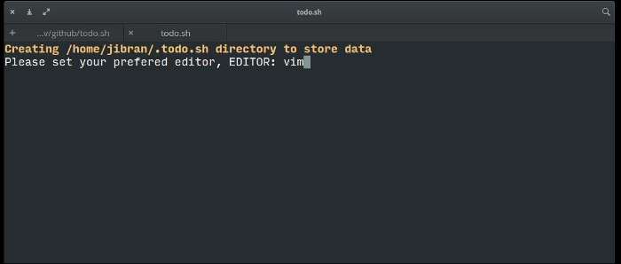
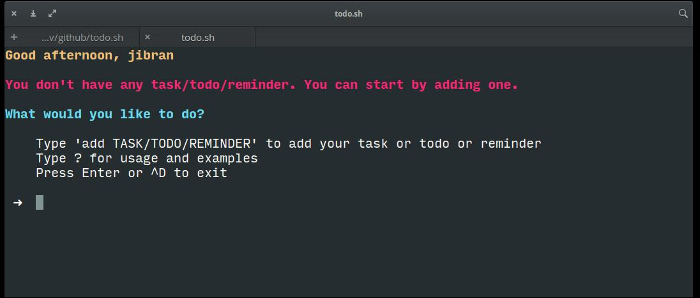
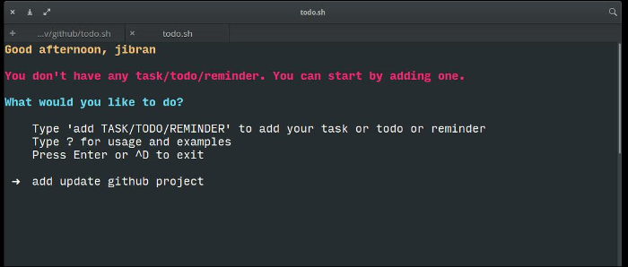
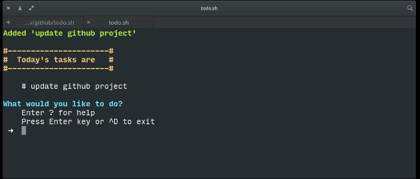

**NOTE**: this project has moved to https://gitlab.com/js-d-coder/todo-sh

# todo.sh

A command-line application written in bash to help you keep track of your daily tasks, to-do, reminders.

## Installation

Clone or download this repository to get `todo` file. Copy it in any path in your `$PATH` environment variable, `/usr/local/bin` or `~/.bin` is recommended.

## USAGE:

After executing the command, you will see a list of tasks (if you have added any)  
and an input prompt that expects input of the form:

`OPERATION TASK [on date]`

`OPERATION` can be add/delete/edit/view.  
 `TASK` can be name of your tasks, todo, reminders.  
 `on date` is optional; it adds `TASK` for the date given.  
 `TASK` (or just 'task' from now on) without date appear in the list everyday i.e. they repeat everyday.

With add operation you can set the name of the task and summary on it.  
With delete operation you can delete the task.  
With edit operation you can edit the summary of the task.  
With view operation you can view full summary of the task.

By default, only first two lines of the summary are shown in the list.

When you launch the program you will see the task for the day and task that repeat everyday.

date can be any human readable date form, `man date` for more.

## Requirements:

You need BASH shell installed. That's it! BASH comes pre-installed on all Linux distributions.  
This programs works well any platform (\*BSD, for example) with BASH shell installed

## Screenshots:

## Troubleshooting:

To prevent users from running multiple instance of todo.sh, it creates `.lock` file in `~/.todo.sh` directory.  
If you are unable to start the application and see this error `Another instance of todo is running` make sure you are not already running it. If that is not the case you should delete `.lock` file and start the application again.

## Future improvements:

[Please refer to TODO.md](TODO.md)

© 2018, Jibran Shaikh (https://github.com/js-d-coder/todo.sh) under MIT License
